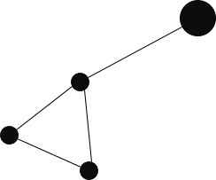

Windows        | Mac/Linux
-------------- | ------------
[](https://ci.appveyor.com/project/tonussi/asll) | [](https://travis-ci.org/tonussi/asll)



# Trabalho

## Definição

Elaborar uma plaicação, com interface gráfica para manipular GLC, envolvendo as sequintes verificaçoes/operações:

- Ler, Editar e Salvar GLC;
- Verificar/Eliminar símbolos INÚTEIS;
- Calcular FIRST(A), FOLLOW(A) e FIRST-NT(A) "definido como sendo o conjnto de símbolos de Vn que podem iniciar sequências derivadas de A" para todo A pertercente a Vn;
- Verificar se G é LL(1):
  - Usando FIRST para verificar se G está fatorada;
  - Usando FIRST-NT para verificar se G possui recursão a esquerda;
- Construir a tabela de parsing LL(1) caso G seja LL(1);
- Efetuar análise sintáica reconhecimento de sentenças usando a técnica LL(1).

## Observações

- Representar as GLC de forma textual seguindo o padrao dos exemplos abaixo:

### a)

```
E -> E + T | E - T | T
T -> T * F | T / F | F
F -> (E)   | id
```

### b)

```
E  -> TE1
E1 -> +TE1 | &
T  -> FT1
T1 -> *FT1 | &
F  -> (E)  | id
```
- Deixar um espaço em branco entre os símbolos do lado direito.
- Representar não-terminais por letra maiúscula (seguida de 0 ou + digitos).
- Representar terminais com um ou mais caracteres contíguos (quaisquer caracteres, exceto letras maiúsculas).
- Usar & para representar epsilon.
- Apresentar os resultados intermediários obtidos.
- O trabalho deverá ser feito em duplas.
- A linguagem de programação é de livre escolha (porém deve ser denominada pelos dois membros da equipe).
- O trabalho deve ser encaminhado por email até dia 05/12. Em arquivo único compactado.
- Além da corretude, serão avaliados aspectos de usabilidade e robustez da aplicação.

# Disciplina

INE5421-05208 (20142)


# Autores

- [Lucas Tonussi](https://github.com/tonussi/)

- [Douglas Klein](https://github.com/)
